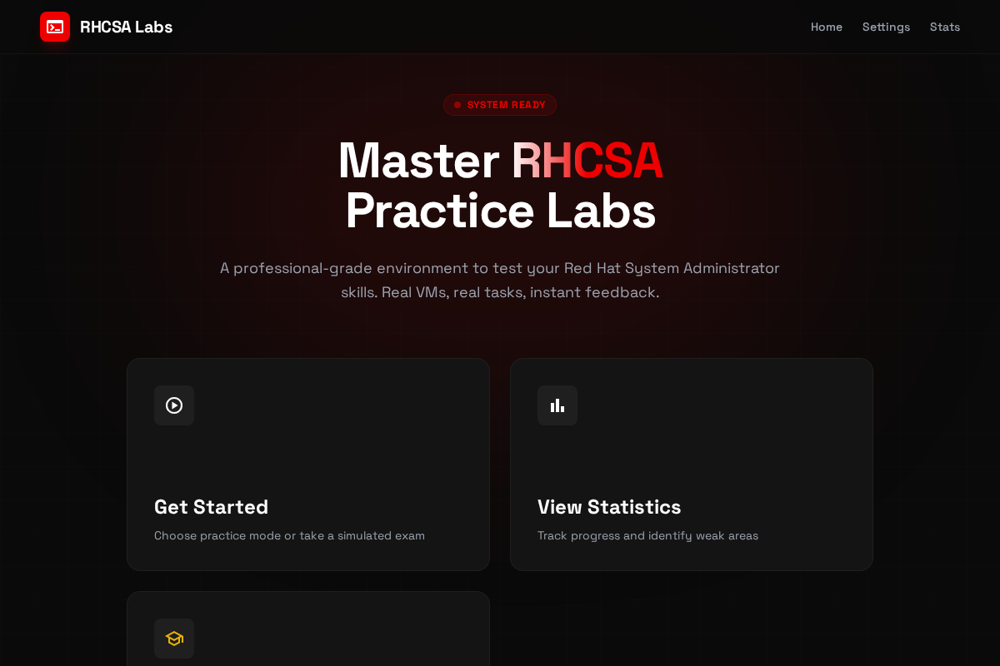
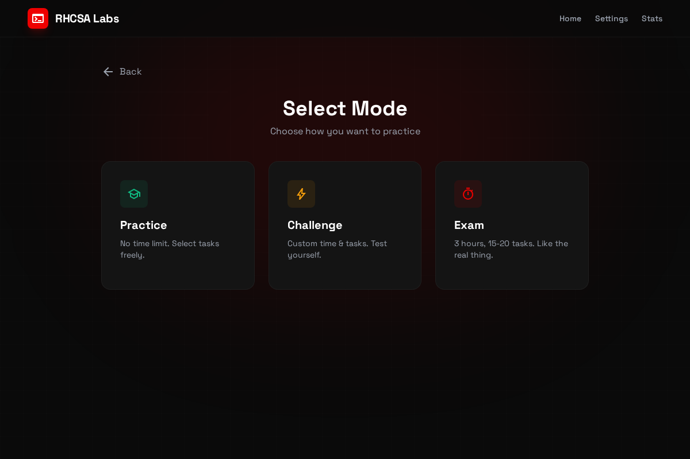
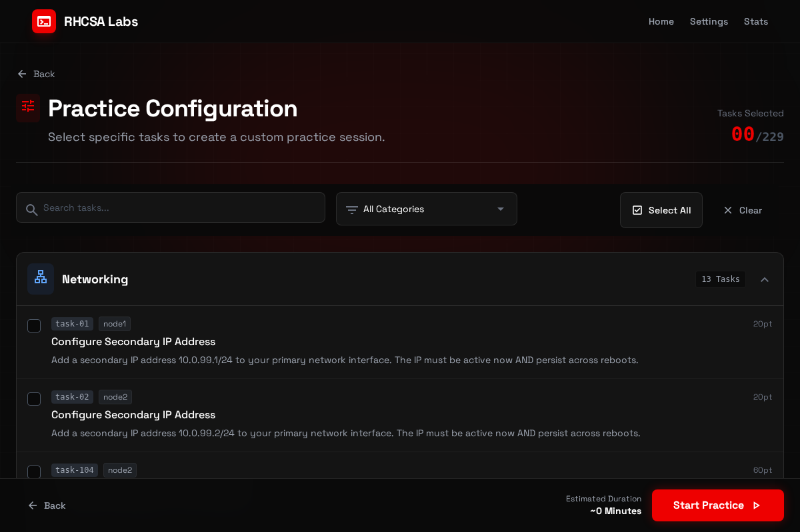
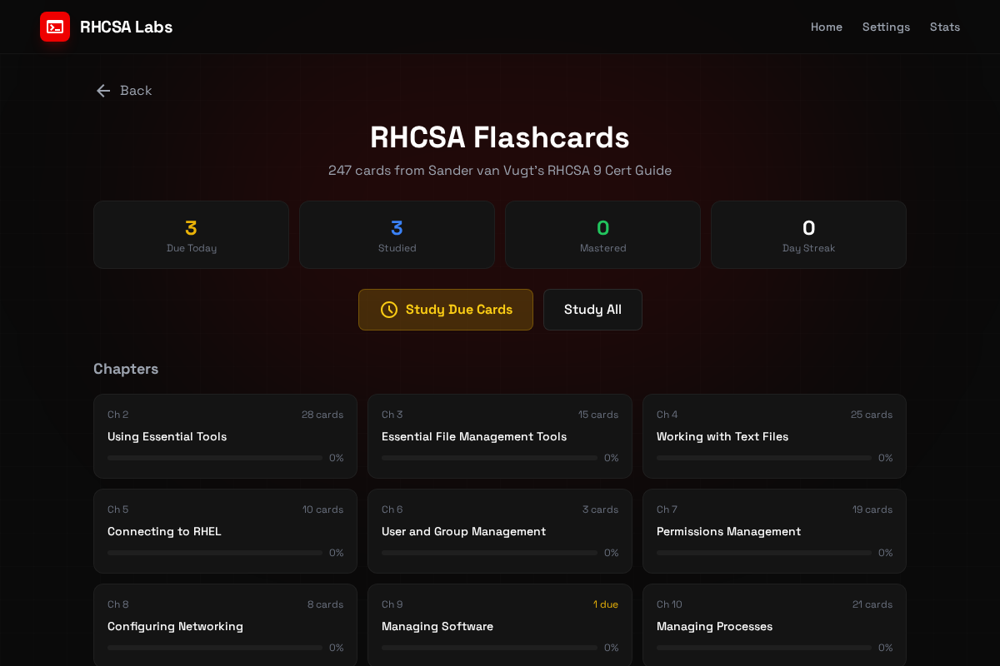

# RHCSA Practice Labs

[](https://opensource.org/licenses/MIT)

A **SadServers-style** practice environment for the **Red Hat Certified System Administrator (RHCSA) exam**. Practice Linux administration tasks on real VMs with instant verification.



## Features

- **229 Practice Tasks** covering all RHCSA exam objectives
- **Real VM Environment** - practice on actual Linux VMs (local or cloud)
- **Instant Verification** - automated checking of your work
- **Multiple Practice Modes**:
  - **Practice Mode** - No timer, select specific tasks or categories
  - **Challenge Mode** - Custom time limits (5-240 min) and task count (1-50)
  - **Exam Mode** - 3 hours, 15-20 random tasks (like the real exam)
- **247 Flashcards** - Anki-style spaced repetition for RHCSA concepts
- **Progress Tracking** - Statistics and weak area identification



## Task Categories

| Category | Tasks | Description |
|----------|-------|-------------|
| Networking | 13 | IP configuration, hostname, firewall |
| Users & Groups | 35+ | User management, sudo, permissions |
| File Systems | 23+ | LVM, partitions, mounts, NFS |
| SELinux & Security | 40+ | Contexts, booleans, troubleshooting |
| Containers | 30+ | Podman, rootless containers, systemd |
| Shell Scripting | 18 | Bash scripts, automation |
| Storage | 20+ | LVM, Stratis, VDO |
| Services | 15+ | systemd, cron, at |
| Essential Tools | 25+ | File operations, text processing |



## Quick Start

### Option 1: Local VMs with Vagrant (Recommended)

```bash
# Clone the repo
git clone https://github.com/mdgjohnny/rhcsa-practice-labs.git
cd rhcsa-practice-labs

# Start VMs (requires Vagrant + libvirt or VirtualBox)
vagrant up

# Install Python dependencies
python3 -m venv .venv
source .venv/bin/activate
pip install -r requirements.txt

# Configure for local VMs
cat > static_vms.json << 'EOF'
{
  "enabled": true,
  "node1_ip": "192.168.99.11",
  "node2_ip": "192.168.99.12",
  "ssh_user": "root",
  "ssh_password": "vagrant"
}
EOF

# Start the app
python api/app_socketio.py
```

Open http://localhost:8080

### Option 2: Manual VMs

If you have existing VMs (VMware, VirtualBox, cloud, etc.):

1. **Set up practice scenarios** on each VM:
```bash
# On node1 (primary):
curl -sSL https://raw.githubusercontent.com/mdgjohnny/rhcsa-practice-labs/main/scripts/setup-local-tasks.sh | sudo bash -s node1

# On node2 (secondary, optional):
curl -sSL https://raw.githubusercontent.com/mdgjohnny/rhcsa-practice-labs/main/scripts/setup-local-tasks.sh | sudo bash -s node2
```

2. **Configure the app** with your VM IPs in `static_vms.json`

3. **Start the app** and practice!

## Flashcards

247 flashcards covering RHCSA concepts from Sander van Vugt's RHCSA 9 Cert Guide:



- Spaced repetition algorithm
- Progress tracking per chapter
- Study due cards or all cards

## Requirements

- Python 3.10+
- For local VMs: Vagrant with libvirt or VirtualBox
- Supported guest OS: Rocky Linux 9, AlmaLinux 9, Oracle Linux 8/9, RHEL 8/9

## Documentation

- [Local VM Setup Guide](docs/local-vm-setup.md)
- [SELinux Tips](docs/selinux-tips.md)
- [VM Recovery](docs/vm-recovery.md)

## How It Works

1. **Practice Tasks** - Each task describes a real-world sysadmin scenario
2. **Web Terminal** - SSH into VMs directly from your browser
3. **Verification Scripts** - Automated checks validate your solution
4. **Instant Feedback** - See exactly what passed/failed and why

## Contributing

Contributions welcome! Areas to help:

- New practice tasks
- Improved verification scripts
- Documentation
- Bug fixes

## License

MIT License - see [LICENSE](LICENSE) for details.

## Credits

Inspired by [SadServers](https://sadservers.com/) - a great resource for Linux troubleshooting practice.

Flashcards based on Sander van Vugt's RHCSA 9 Cert Guide.

## Known Limitations

- **Container tasks on 1GB VMs**: Cloud free-tier VMs (1GB RAM) may OOM when running podman. Use local VMs with 2GB+ RAM for container tasks, or use Vagrant which allocates 2GB by default.
- **OCI Cloud Setup**: Requires Oracle Cloud Infrastructure account and API keys. See `infra/README.md` for setup.
